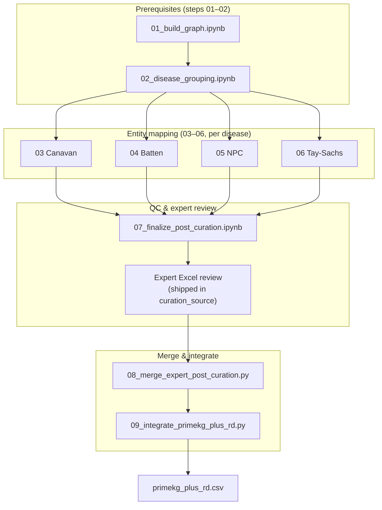

# Literature curation audit trail (steps 03–09)

This folder documents the **full PubMed/PMC curation pipeline** that produces `dataset/PrimeKG-Plus-RD/primekg_plus_rd.csv`. Steps **01–02** (graph build and disease grouping) live in `scripts/`; literature curation continues here from **03**.

The release ships **curated CSVs** and **integration outputs** so users can rebuild `primekg_plus_rd.csv` without raw curation spreadsheets. The numbered notebooks and scripts below are the **authoritative audit trail** copied from the lab `knowledge_graph/` workflow.

---

## Pipeline overview



| Step | Script | Type | Main outputs |
|------|--------|------|--------------|
| **03** | `03_map_curated_entities_canavan.ipynb` | notebook | UMLS + SapBERT/SBERT entity mapping for Canavan; algorithm `*_final.csv` intermediates |
| **04** | `04_map_curated_entities_batten.ipynb` | notebook | Same for Batten disease |
| **05** | `05_map_curated_entities_npc.ipynb` | notebook | Same for Niemann–Pick type C (NPC) |
| **06** | `06_map_curated_entities_tay_sachs.ipynb` | notebook | Same for Tay–Sachs |
| **07** | `07_finalize_post_curation.ipynb` | notebook | Second-search QC tables (`*_second_search_review.csv`) per disease |
| — | *(expert review)* | — | QC team Excel files (shipped under `curation_source/Post curation/Review after second suggest/`) |
| **08** | `08_merge_expert_post_curation.py` | Python | `{Disease}_additional_relations_v2.csv`, expert audit CSVs |
| **09** | `09_integrate_primekg_plus_rd.py` | Python | `primekg_plus_rd.csv`, `literature_edges_*.csv`, integration summary JSON |

Steps **03–06** are independent per disease (any order). **07** needs their outputs. **08** needs expert Excel files. **09** needs `primekg_plus.csv`, `nodes.csv`, and the eight curated CSVs.

---

## What ships in the Zenodo bundle

| Artifact | Location |
|----------|----------|
| Extracted curation workspace (~6 MB) | `dataset/PrimeKG-Plus-RD/curation_source/` — default `CURATION_ROOT` (deduplicated layout; see `curation_source/README.md`) |
| Algorithm finals + expert additionals | `dataset/PrimeKG-Plus-RD/curated/*_final.csv`, `*_additional.csv` |
| Integrated graph | `dataset/PrimeKG-Plus-RD/primekg_plus_rd.csv` |
| Audit notebooks & scripts | `scripts/literature_curation/03_*` … `09_*` |

**Not included:** PDF paper archives, legacy 2.3 GB `kg-old.csv` snapshots (use `PLUS_KG` = `primekg_plus.csv` instead), other disease cohorts (e.g. Psoriasis).

Details: [`dataset/PrimeKG-Plus-RD/curation_source/README.md`](../../dataset/PrimeKG-Plus-RD/curation_source/README.md)

To **re-run the full pipeline**, use the bundled `curation_source/` (or set `CURATION_ROOT`). To **rebuild only** `primekg_plus_rd.csv` from shipped `curated/`, run step **09** after steps **01–02**.

---

## Environment variables

| Variable | Used by | Default / notes |
|----------|---------|-----------------|
| `CURATION_ROOT` | 03–08 | Default: `dataset/PrimeKG-Plus-RD/curation_source/` (bundled extract) |
| `PLUS_NODES` | 08, 09 | `dataset/PrimeKG-Plus/nodes.csv` |
| `PLUS_KG` | 09 | `dataset/PrimeKG-Plus/primekg_plus.csv` |
| `CURATED_DIR` | 09 | `dataset/PrimeKG-Plus-RD/curated/` |
| `PRIMEKG_ROOT` | 09 (SapBERT memmap) | PrimeKG repo with `datasets/` if re-encoding entities |
| `UMLS_API_KEY` | 03–06 | NLM UTS API key (required for UMLS search cells; not stored in repo) |
| `UMLS_MEMMAP_DIR` | 03–06 via `lib/` | Local UMLS SapBERT embedding pool (optional; not shipped) |

## Python dependencies (step 08)

Step **08** reads `.xlsx` expert-review files and requires `openpyxl`.

```bash
pip install -r scripts/literature_curation/requirements.txt
```

---

## Run order (full rebuild)

### 0. Prerequisites

```bash
# primary data prep → see primary_data_prep/README.md
jupyter nbconvert --execute scripts/01_build_graph.ipynb
jupyter nbconvert --execute scripts/02_disease_grouping.ipynb
```

Produces `dataset/PrimeKG-Plus/primekg_plus.csv` and `nodes.csv`.

### 1. Entity mapping (03–06)

```bash
export UMLS_API_KEY=your_nlm_uts_key   # required for steps 03–06

jupyter nbconvert --execute scripts/literature_curation/03_map_curated_entities_canavan.ipynb
jupyter nbconvert --execute scripts/literature_curation/04_map_curated_entities_batten.ipynb
jupyter nbconvert --execute scripts/literature_curation/05_map_curated_entities_npc.ipynb
jupyter nbconvert --execute scripts/literature_curation/06_map_curated_entities_tay_sachs.ipynb
```

Requires: raw curated CSVs per disease, UMLS/SapBERT assets under `lib/`, and a local UMLS embedding memmap for SapBERT reranking.

### 2. Post-curation QC (07)

```bash
jupyter nbconvert --execute scripts/literature_curation/07_finalize_post_curation.ipynb
```

Writes per-disease `*_second_search_review.csv` files used by the QC team.

### 3. Expert review

QC team Excel files are **included** in `dataset/PrimeKG-Plus-RD/curation_source/Post curation/Review after second suggest/`. No separate download is required for the published bundle.

### 4. Merge expert decisions (08)

```bash
cd scripts/literature_curation
export PLUS_NODES=../../dataset/PrimeKG-Plus/nodes.csv

python 08_merge_expert_post_curation.py --publish-release
```

`--publish-release` writes `dataset/PrimeKG-Plus-RD/curated/{Disease}_additional.csv`.

Algorithm finals (`*_final.csv`) are produced by steps **03–06** and materialized from `$CURATION_ROOT/Post curation/20260508-*_final.csv` (NPC: `NMP_final.csv` → release name `NPC_final.csv`).

### 5. Graph integration (09)

```bash
cd scripts/literature_curation
python 09_integrate_primekg_plus_rd.py
# or: python integrate_primekg_plus_rd.py   # same CLI
```

---

## Release-only rebuild (steps 01–02 + 09)

If you only need to refresh `primekg_plus_rd.csv` from the **shipped** curated CSVs:

```bash
jupyter nbconvert --execute scripts/01_build_graph.ipynb
jupyter nbconvert --execute scripts/02_disease_grouping.ipynb
cd scripts/literature_curation && python 09_integrate_primekg_plus_rd.py
```

---

## `lib/` helpers

| Module | Role |
|--------|------|
| `entity_resolver.py` | Resolve curated entity names to PrimeKG-Plus nodes/CUIs (used by step 09) |
| `relation_config.py` | Relation normalization and unsupported-relation rules |
| `sapbert_encode_primekg_style.py`, `sapbert_pool_encode.py` | SapBERT encoding (steps 03–06) |
| `query_sapbert_rerank_sbert.py` | Optional UMLS pool query CLI |

---

## Mapping to shipped curated filenames

| Release file | Source (lab) |
|--------------|--------------|
| `Canavan_final.csv` | `$CURATION_ROOT/Post curation/20260508-Canavan_final.csv` |
| `Batten_final.csv` | `$CURATION_ROOT/Post curation/20260508-Batten_final.csv` |
| `NPC_final.csv` | `$CURATION_ROOT/Post curation/20260508-NMP_final.csv` |
| `Tay-Sachs_final.csv` | `$CURATION_ROOT/Post curation/20260521-Tay-Sachs_final.csv` |
| `Canavan_additional.csv` | step 08 → `merged_expert_v2/Canavan_additional_relations_v2.csv` |
| `Batten_additional.csv` | step 08 → `…/Batten_additional_relations_v2.csv` |
| `NPC_additional.csv` | step 08 → `…/NPC_additional_relations_v2.csv` |
| `Tay-Sachs_additional.csv` | step 08 → `…/Tay-Sachs_additional_relations_v2.csv` |

`scripts/materialize_release_bundle.sh` copies these into `dataset/PrimeKG-Plus-RD/curated/` when building the Zenodo tarball.

---

## Provenance

| Step | Original lab file |
|------|-------------------|
| 03 | `knowledge_graph/20260505-FINAL-Canavan-Compare_string_vs_SapBERT_mapping.ipynb` |
| 04 | `knowledge_graph/20260505-FINAL-Batten-Compare_string_vs_SapBERT_mapping.ipynb` |
| 05 | `knowledge_graph/20260505-FINAL-NPC-Compare_string_vs_SapBERT_mapping.ipynb` |
| 06 | `knowledge_graph/20260522-FINAL-Tay-Sachs-Compare_string_vs_SapBERT_mapping.ipynb` |
| 07 | `knowledge_graph/20260508-Post_curation.ipynb` |
| 08 | `knowledge_graph/merge_expert_post_curation.py` |
| 09 | `knowledge_graph/integrate_primekg_plus_rd.py` (release-hardened paths) |
